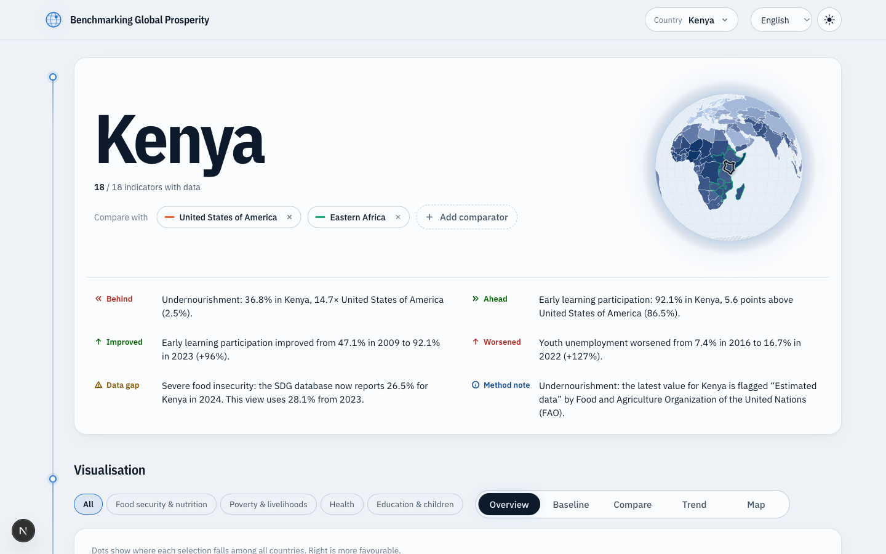
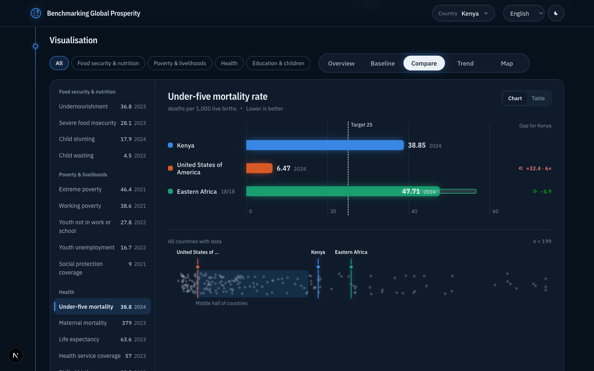
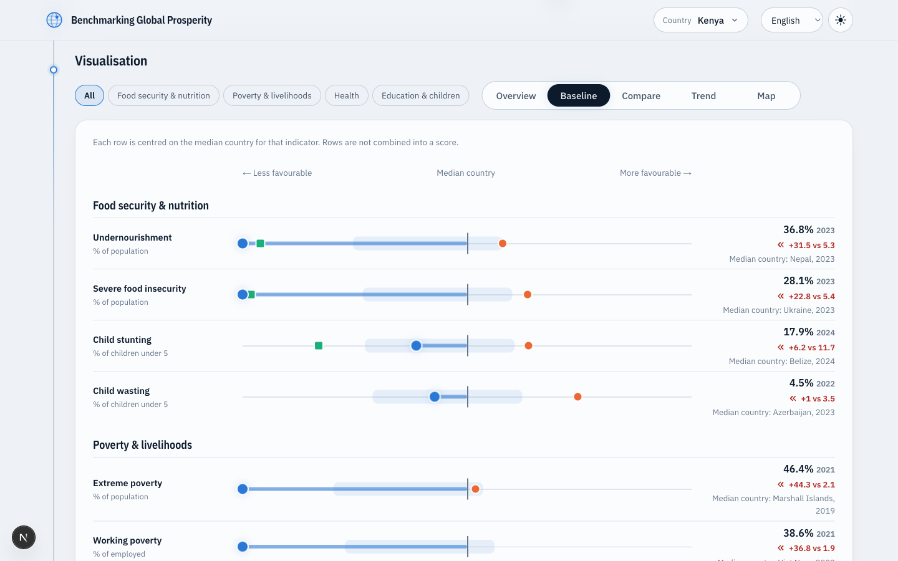
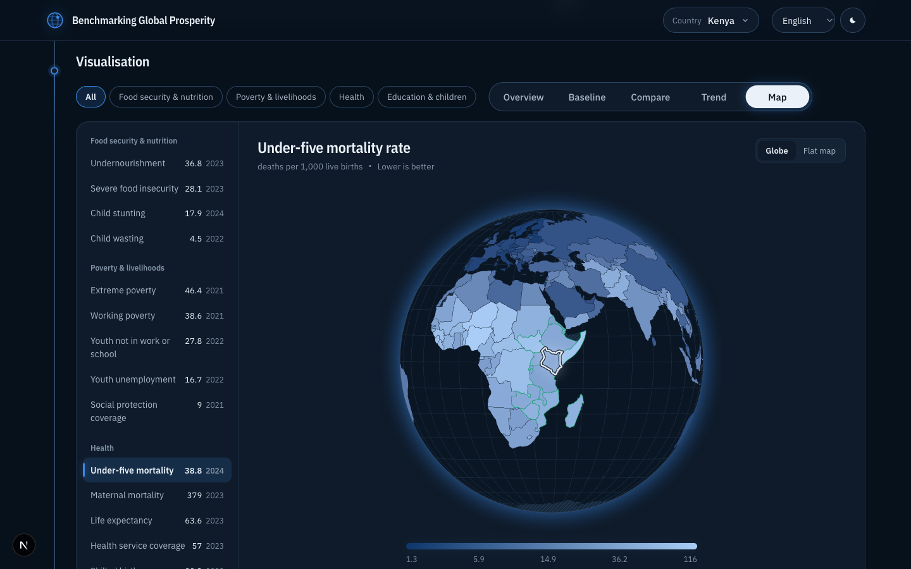
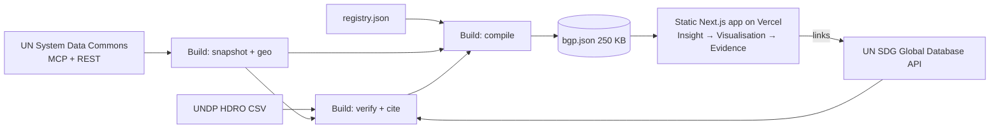

# Benchmarking Global Prosperity

A web app for comparing countries on food, poverty, health and education indicators, and tracing every figure back to its official source.

**Live:** https://benchmarking-global-prosperity.vercel.app  
**How values are verified:** https://benchmarking-global-prosperity.vercel.app/verification

| | |
| --- | --- |
|  |  |
|  |  |

## The problem

The UN System Data Commons holds authoritative development statistics, but a researcher who wants one answer has to assemble it by hand:

> Where does Kenya stand on child mortality, how does it compare with the United States and with East Africa, how has it changed, and what supports the figures?

- Observations are reachable only through MCP tools. The server's own playbook asks for three steps per indicator: search, check metadata, fetch observations.
- For one country, two comparators and 18 indicators that is **90 tool calls** (18 + 18 + 54), each taking 0.35 to 1.3 s in our runs.
- Search returns many disaggregated variants of each indicator. Picking the right one, its unit and which direction is better is left to the reader.
- Nothing on the way says whether a value is observed or modelled, how old it is, or where to check it.

## The solution

One page, three connected areas, following the specification's rule: **Insight, then visualisation, then evidence.**

| Area | What it does |
| --- | --- |
| Insight | A few findings for the selected country, such as the largest gap to a comparator, the biggest change since 2015, and where the official source has newer data. Each finding names its indicator and opens its chart. |
| Visualisation | Five views driven by the same selection: **Overview**, **Baseline** (every indicator against its median country), **Compare**, **Trend** and **Map** (a globe you can drag). |
| Sources & evidence | For the indicator on screen: official title and target text, reporting agencies, data-nature flags, and a row for every country or group member showing the value in the view, the official current value and a link to check it. |

Design choices that follow from the specification:

- No overall score and no league table. The Baseline view centres each row on the median country and never adds rows together.
- Values the source publishes as thresholds (for example undernourishment below 2.5%) are shown as `<2.5` and never used to compute a gap, ratio or change.
- Directionality is stored per indicator, so "better" always points the same way.
- Observation year is always shown. Older-than-five-years values, gaps between observations and missing data are drawn as marks.
- Six languages including right-to-left Arabic, light and dark themes, and a table view for the Compare and Trend charts.

## Results

Measured on 2026-09-20. Full method in [docs/metrics.md](docs/metrics.md).

| | |
| --- | ---: |
| Curated indicators across 4 dimensions | 18 |
| Observations, from 228 areas | 48,089 |
| Attempted against the official publisher | 100% |
| Identical to it | **94.0%** |
| Within 1% of it | 94.3% |
| Published at source as a threshold, such as `<2.5` | 1,159 |
| Tool calls for the same answer done by hand | 90 |
| Tool calls in the app after first load | 0 |
| Data payload, compressed | 250 KB |
| Largest contentful paint, production | 376 ms |
| Layout shift | 0.00 |
| Lighthouse accessibility, best practices, SEO | 100 / 100 / 100 |

### Where the graph and the official database differ

14 of the 18 series match the official publisher exactly. Four do not, mostly because the graph is a snapshot of an older release:

| Series | Identical | Cause |
| --- | ---: | --- |
| Undernourishment | 35.0% | Revised estimates, newer year at source for 100 countries |
| Severe food insecurity | 91.3% | Newer year at source for 124 countries |
| Extreme poverty | 88.2% | Revised estimates, newer year at source for 70 countries |
| Life expectancy | 99.0% | 68 of 6,630 values differ from UNDP's file |

The app does not hide this. The Sources area shows both values side by side, and a finding says when the official database has moved on.

## Architecture



Data is pulled and checked at build time, then explored entirely in the browser. Details and the reasoning are in [docs/architecture.md](docs/architecture.md).

## Data sources

- **UN System Data Commons** supplies every plotted value and the UN geographic groupings.
- **UN SDG Global Database API** supplies official indicator titles, target text, reporting agencies, data-nature flags and uncertainty bounds, and is the independent check for 17 series.
- **UNDP HDRO** supplies and checks life expectancy.
- **Natural Earth 1:10m countries** supply the shapes for the map.
- **Humanitarian Data Exchange is not in the graph.** No observation carries an HDX provenance, so it is out of scope for this version. See [docs/data-sources.md](docs/data-sources.md).

## Run it

Requires Node 24.

```bash
npm install
npm run dev            # builds the data file, then starts on http://localhost:3000
npm run build          # production build
npm run check          # statistics self-check
```

Refresh the data and verification (about 30 minutes, mostly the SDG database):

```bash
npm run data:snapshot          # pull indicators and groupings from the MCP server
node scripts/verify.mjs        # compare with SDG database and UNDP, write cited metadata
node scripts/links.mjs         # resolve and check methodology links
npm run data                   # compile the static file and metrics
```

## Repository layout

```
app/                  Next.js pages, styles, verification page
components/           Insight, visualisation views, evidence, globe, controls
lib/                  Statistics, findings, i18n, state, sources
data/registry.json    The 18 indicators: direction, unit, baseline, target
data/snapshot/        One file per indicator pulled from the graph
data/sdg-meta.json    Cited metadata from the SDG API
data/verification.json  Result of every comparison
scripts/              snapshot, geo, verify, links, build-data
docs/                 architecture, data sources, design, metrics, specification
```

## Known limits

- Values are a snapshot, not live. A live refresh would replace `scripts/snapshot.mjs` with a cached server route; the client reads one file through `lib/use-dataset.ts`.
- Interface text, country names and numbers are translated into all six UN languages. Indicator names, official definitions and UN grouping names are shown in English until official translations are added, and a note says so. Interface strings were written for this project and have not had UN terminology review.
- "Better" direction is an editorial decision recorded in the registry, following each SDG target's intent.
- Numeric target lines appear only where the official target text states a number (under-five mortality, maternal mortality).
- The Data Commons graph lists no "source updated" date, so the app says so instead of inventing one.
- Greece and Slovenia lack UN sub-region membership in the REST responses we could retrieve.
- Custom peer groups are built by choosing three or more countries (or using UN groupings) and are compared by their median. Building groups by thematic characteristics needs metadata the graph does not expose.
- Phase two of the specification (linking indicators to UN efforts) is not built.

## More

- [Design decisions](docs/design.md)
- [Specification](docs/specification.txt)
- [Demo video: how it is made and redone](demo/README.md)
