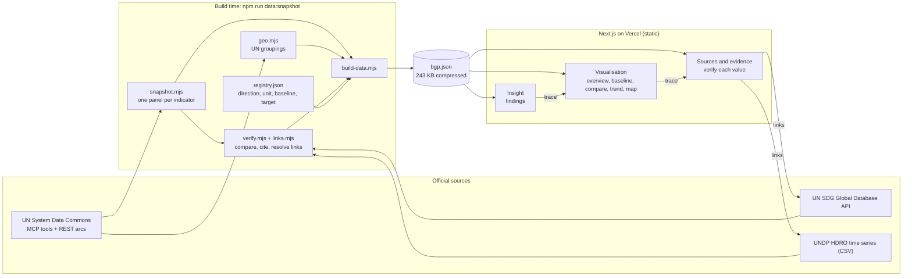

# Architecture

Data is pulled and checked at build time, compiled into one static file, and explored entirely in the browser. There is no runtime server and no runtime call to any UN service.

## Why this shape

| Choice | Reason |
| --- | --- |
| Build-time snapshot | The MCP endpoint speaks JSON-RPC over server-sent events and rate-limits the REST arcs, so a browser cannot call it directly. A snapshot removes the proxy, rate-limit handling and outage states, and keeps the deployment independent of a staging service. |
| One static file | All 18 indicators for 228 areas are 243 KB compressed. Every interaction after load is an in-memory computation with no network request. |
| Registry in JSON | Directionality, display unit, baseline year and numeric targets are decided once, in one reviewable file. Everything else (titles, target text, agencies, data-nature flags) is read from the SDG API, not written by hand. |
| Verification in the pipeline | Each refresh compares every observation with the official publisher and stores the result, so a stale or revised value is visible instead of silent. |

## Insight, visualisation, evidence

1. `lib/insights.ts` turns the loaded data into a few findings. Each finding carries the indicator it comes from.
2. Selecting a finding sets the indicator and view, and the visualisation redraws.
3. `components/evidence-panel.tsx` reads the same selection and lists the value, the official current value, the source flag, the reporting agency and a link for every country or group member on screen.

## Where a live refresh would go

Replace `scripts/snapshot.mjs` with a server route that calls the MCP tools and caches per indicator. `lib/use-dataset.ts` is the only reader of the compiled file, so the client would not change.
